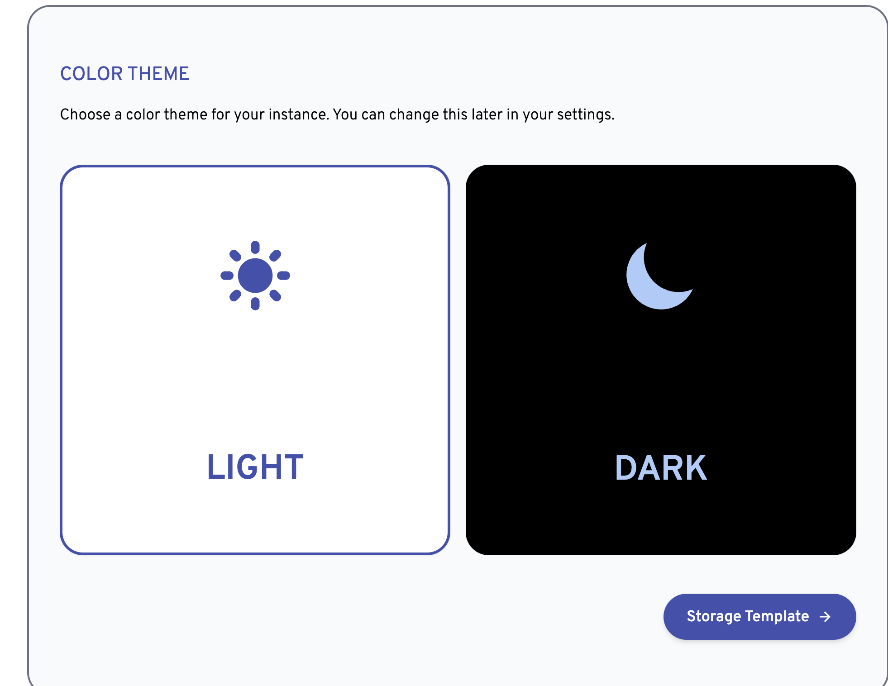
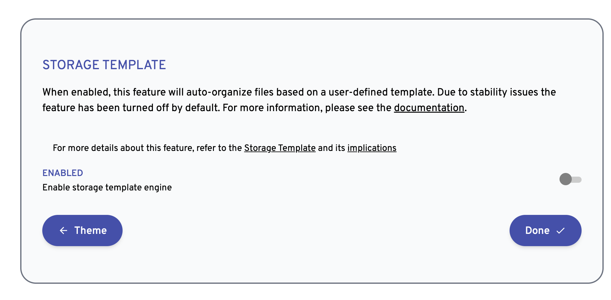

# immich-app

[中文](./docs/zh_readme.md)

A best practice project for installing and using immich. Immich is an open-source, private photo management solution that enables you to establish your own private photo library.


## Version


Official Immich website: https://immich.app/docs/install/docker-compose/


- Server: v1.101.0
- Mobile: v1.101.0


> The server version and the mobile app version must be aligned, to prevent any compatibility issues.

## Use


### 1. Install the server with docker-compose


bash

```bash
cd compose
docker-compose up -d
```


### 2. Web Interface Access and Configuration


Once the installation is complete, the web interface can be used for initial setup and configuration, accessible at: `http://<ipaddress>:2283`


Set up administrator information:


Choose a UI theme:




Configure the Storage Template, the default option will suffice.




### 3. Install the mobile application


- [Google Play Store](https://play.google.com/store/apps/details?id=app.alextran.immich)
- [Apple App Store](https://apps.apple.com/us/app/immich/id1613945652)
- [F-Droid](https://f-droid.org/packages/app.alextran.immich)
- [GitHub Releases (apk)](https://github.com/immich-app/immich/releases)


The mobile app's access address is: `http://<ipaddress>:2283/api`
