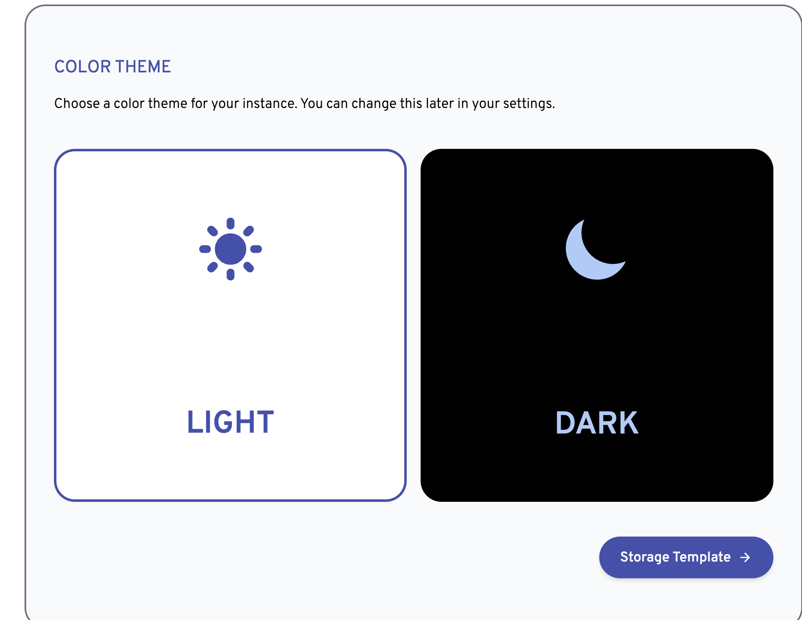
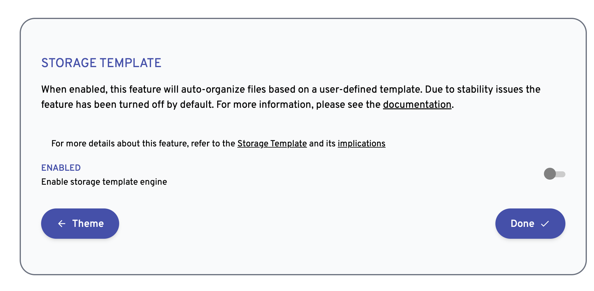

# immich-app
一个用来安装和使用 immich 的最佳实践工程。 Immich 是一个开源的私有化图片管理方案，可以用来建立私有的图片库。

## 版本

Immich 官方网站： https://immich.app/docs/install/docker-compose/

- Server: v1.101.0
- Mobile: v1.101.0

>  服务端的版本和手机端的版本必须是一致的，否则可能会出现兼容问题。

## 使用

### 1. 使用 docker-compose 安装服务端

```
cd compose
docker compose up -d
```

### 2. Web 界面访问和配置

安装完成后，可以通过 web 界面进行初始化和配置，地址为： `http://<ipaddress>:2283`


初始化管理员信息：


选择 UI 主题



配置 Storage Template,选择默认即可。



### 3. 安装手机端

- [Google Play Store](https://play.google.com/store/apps/details?id=app.alextran.immich)
- [Apple App Store](https://apps.apple.com/us/app/immich/id1613945652)
- [F-Droid](https://f-droid.org/packages/app.alextran.immich)
- [GitHub Releases (apk)](https://github.com/immich-app/immich/releases)

手机端访问地址为：`http://<ipaddress>:2283/api`
